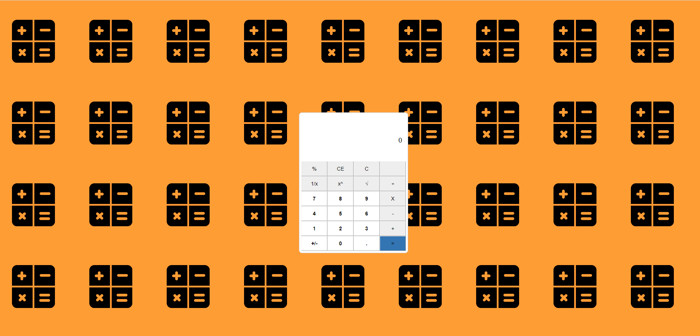

# Calculator

This calculator was created just looking `windows calculator - standar mode-`.

</img>

## Some difference with `windows calculator - standar mode-`

- Porcentage works a bit different, instance of do `10x30` and then `%`, here just need use `10%30` and it will return the porcentage

## How was built?

This proyect was built with html, css (sass) and Vainilla JavaScript.
It is used a bit of unit test too.  

## Folder Struct

Css: Contains style of proyect.  
js: contains two folders `functionalities` and `helpers`
 - functionalities: have all principaly functions
 - helpers: have extract functionalities.  
Test: contains unit tests

## Features and Curent Problems

You can find all it in the file called `version.md`.  
The top version is always the last version.
 
## How to run this proyect

Just up the `index.html` with a live-server.