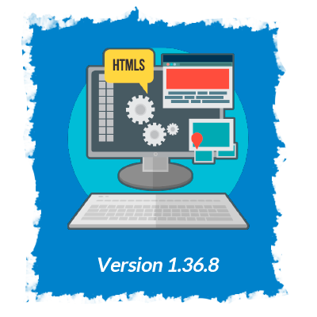

The version in the top of this file is the last version.

 
 

</img>

### ★ Recoil Button ★

- Added the icon for this button
- When this button is pressed the result value will come to pre value.

### ★ Favicon ★

- Added a Favicon.

### ★ Change Sing ★

- Now is possible change of sign with operation like `1/(32)+1/(12)`.  

### ★ History ★

- <b>Added icon of history</b>: When do click in this icon it will show the history list.
- <b>Added icon of Delete History</b>: When do click in this icon, all history will be deleted and delete history icon will disappert too.  
- <b>List of history</b>: it will show all operation history, if there is nothing it will show "Aun no hay historial"

### ★ Mode Name ★

- Added the name of mode in the top of calculator

</img>

- Regular Expressions were tweaks for they were more exact
- Now there is just one regular expression that get the numbers (exceExpression.js) for case like fractions/potency and squareroot.
- Regular Expression about sum, substract, multiply and division are now more exact for use one expression for each operation, also, now those are handle since testExpression.
- Porcentage code was tweaks and now it is handle since operations function

</img>

- The change the sign work fine in normal cases.
- Was fixed that when you changed the sign or try to do another operation after show result with equal(`=`) it did a new operation, instead of change the sign and show the value of result.
- Equal button now show fine a fraction/potency/squareRoot operation
- Was correct that in case like `Fracion - number`, `potency - fraction`, `squareRoot - fraction` and `squareRoot - Potency` didnt name a correct division.
- Was fixed that porcentage doesnt show operation after use Equal.

</img>

### ★ History ★
- History list show in reverse order the operations
- Is not possible that one result of list render in the screen.
- If only press `=` it wont log the operation

### ★ Screen ★

- If the is a very long number it will out of screen. 

### ★ Fraction/Potency/SquareRoot ★

- If you have the expression `3+1/(3)` and press again `1/x` it add a new `1/(x)` instance of remplace the denominator of orignal `1/(x)`
- If you have the expression `1/(3)+1/(3)` and press again `1/x` it add a new `1/(x)` at operation instance of remplace the denominator of last `1/(x)`

- If you have the expression `3 + sqr(3)` and press again `x^` it add a new `sqr(x)` instance of remplace the denominator of last `sqr(x)`
- If you have the expression `sqr(x) + sqr(x)` and press again `x^` it add a new `sqr(x)` at operation instance of remplace the denominator of last `sqr(x)`

- If you have the expression `3 + √(3)` and press again `x^` it add a new `√(x)` instance of remplace the denominator of last `√(x)`
- If you have the expression `√(x) + √(x)` and press again `x^` it add a new `√(x)` at operation instance of remplace the denominator of last `√(x)`

- For now it not enabled do porcentage operations with fractions, potency and squareRoot.

------------------------------------------------------------------
 
 

</img>

### ★ Negative sign ★
- Button `+/-`: Add and quit the sign `-`.

### ★ Fractions ★
- Added buttons of `1/x`.
- Button of `1/x` divide numerator `1` for denominator `x` and show the result
- It is possible add until two `1/x`, separete by a sing, like `1/(2)-1(32)`.  
- It is possible add expression like `3+1/(10)`.  
- Now it is possible make an operation like `1/(10)*1/(2)` - Need a rework 
- Now is possible make an operation like `5+1(10)`
- Now is possble an operation is as a expression like `1/(3) + 4`
- is possible make negative operation with fractions - still need be teste a lot-
- It is possible do Negative account with fractions.   
- It is possible do operation like `1/(2) + sqr(3)`, `1/(2) + √(3)`

### ★ Potency ★

- Added button of `x^`.
- Button of potence add a sqr(x) in operation taking the number of `result` and after add the sqr(x) in operation, show the result of potence in `result`.  
- It is possible add until two `sqr(x)`, separete by a sing, like `sqr(2)-sqr(32)`.  
- It is possible add expression like `3+sqr(10)`.  
- Now it is possible add expression like: `sqr(3) + sqr(3)`, `sqr(3) + 3` and `3 + sqr(3)`
- Now it is possible add operations like `sqr(3) + sqr(3)`, `sqr(3) + ` and `3 + sqr(3)`
- It is possible do Negative account with potency.  
- It is possible do operation like `√(3) + sqr(3)`, `sqr(3) + √(3)`

### ★ Raiz ★

- Added buttons of `√`.
- Button of potence add a sqr(x) in operation taking the number of `result` and after add the sqr(x) in operation, show the result of potence in `result`.  
- It is possible add until two `√(number)`, separete by a sing, like `√(2)-√(32)`.  
- It is possible add expression like `3+√(10)`.  
- Now it is possible add expression like: `√(3) + √(3)`, `√(3) + 3` and `3 + √(3)`
- Now it is possible add operations like `√(3) + √(3)`, `√(3) + ` and `3 + √(3)`
- It is possible do Negative account with quareRoot.  
- It is possible do operation like `√(3) + sqr(3)`, `sqr(3) + √(3)`

### ★ Test ★

- Added unit tests

</img>

- Basic Operations with negative numbers should be work fine now.
- The point is repeting more than 1 time

</img>

-  the change the sign is disabled for now because it cause a few issue.
- If the is a very long number it will out of screen. 

- Delete buttons dont have functionality yet

- Equal button can dont show all operation in some case like fractions

- If you have the expression `3+1/(3)` and press again `1/x` it add a new `1/(x)` instance of remplace the denominator of orignal `1/(x)`
- If you have the expression `1/(3)+1/(3)` and press again `1/x` it add a new `1/(x)` at operation instance of remplace the denominator of last `1/(x)`

- If you have the expression `3 + sqr(3)` and press again `x^` it add a new `sqr(x)` instance of remplace the denominator of last `sqr(x)`
- If you have the expression `sqr(x) + sqr(x)` and press again `x^` it add a new `sqr(x)` at operation instance of remplace the denominator of last `sqr(x)`

- If you have the expression `3 + √(3)` and press again `x^` it add a new `√(x)` instance of remplace the denominator of last `√(x)`
- If you have the expression `√(x) + √(x)` and press again `x^` it add a new `√(x)` at operation instance of remplace the denominator of last `√(x)`

- For now it not enabled do porcentage operations with fractions, potency and squareRoot.

---------------------------------
# version 1.1.1

</img>

- Refactor for deleted useless code

</img>

- Button `+/-`: his funcionality is not ready yet.   
- Operations with negative numbers: It is not working properly.   